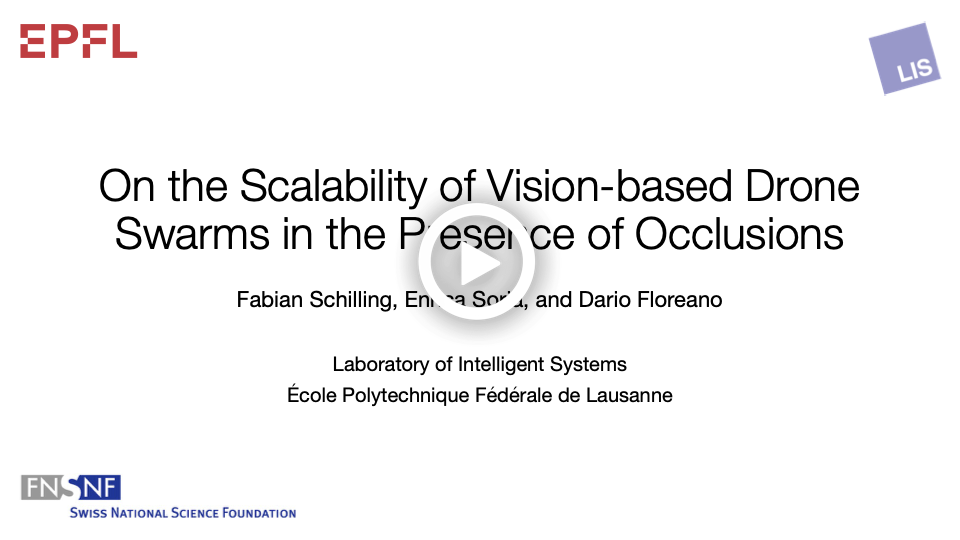
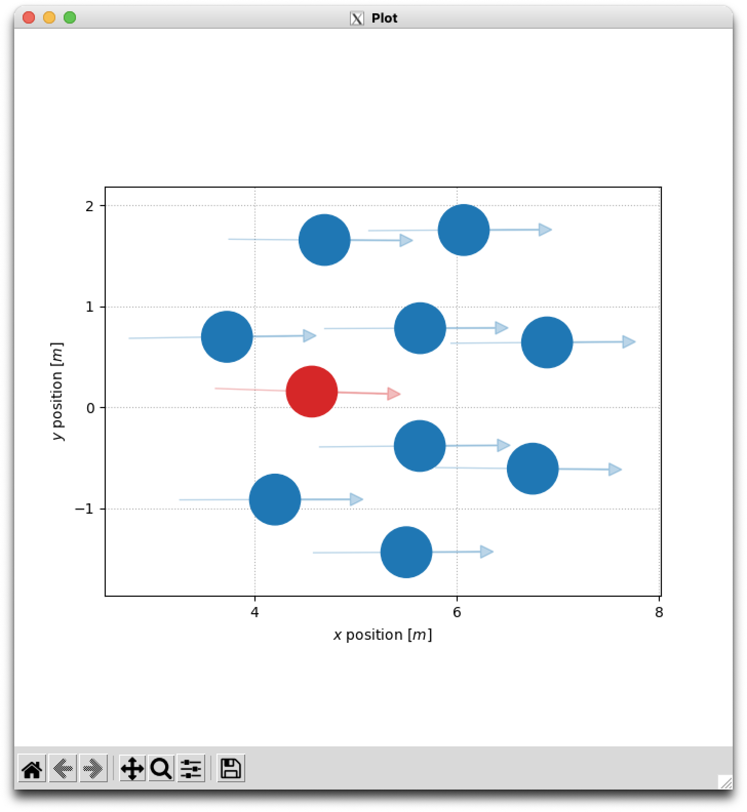
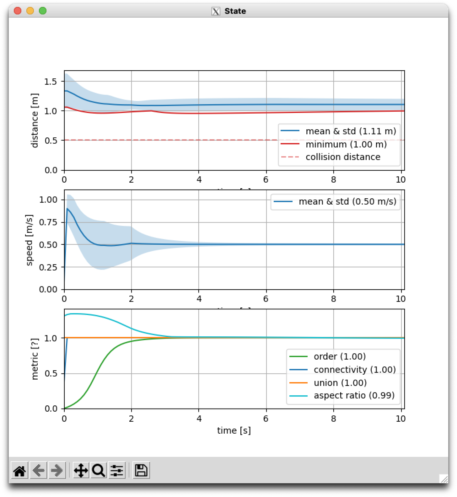
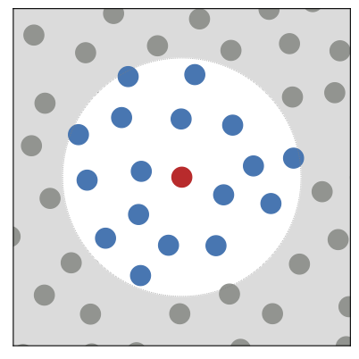
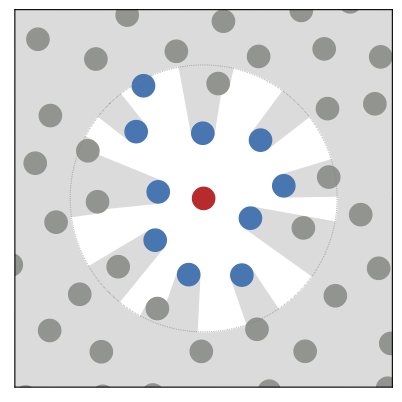
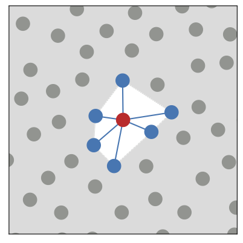
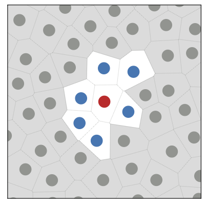

# vmodel

The `vmodel` package implements an agent-based model to simulate visual-detection-based swarms in [Python](https://www.python.org/).
It is designed to generate statistical data of swarms with large groups sizes (~1000s of agents) and random initial conditions.
It features several [flocking algorithms](#flocking-algorithms), [neighbor selection methods](#neighbor-selection), and [sensor noise parameters](#sensor-noise).
The simulation can be run as a [graphical](#running-the-simulation-graphical) session with visualizations for rapid prototyping or in [headless](#running-the-simulation-headless) mode to quickly generate statistical results from repeated runs.

This repository contains the source code accompanying the article:

F. Schilling, E. Soria, and D. Floreano, "**On the Scalability of Vision-based Drone Swarms in the Presence of Occlusions**," *IEEE Access*, vol. 10, pp. 1-14, 2022. [[**IEEE** *Xplore*](https://ieeexplore.ieee.org/abstract/document/9732989)] [[Citation](#citation)]

The following [video](https://youtu.be/3-O85lB_DJQ) gives a high-level explanation of the findings of the article:

<p align="center">
  <a href="https://youtu.be/3-O85lB_DJQ"></a>
</p>

## Requirements

- [Git](https://git-scm.com/downloads)
- [Python](https://www.python.org/downloads/) (at least version `3.6.9`)

## Getting started

Clone this repository and move into its root folder:

```bash
git clone git@github.com:lis-epfl/vmodel.git
cd vmodel
```

### Installation

Use `pip` to install the `vmodel` package (preferably in a newly created [virtual environment](https://docs.python.org/3/tutorial/venv.html)):

```bash
python3 -m pip install --editable .
```

This command will install all necessary requirements and add the `vmodel` simulator script (among others) to your `$PATH`.

The `--editable` flag ensures that any changes you make to the code in this repository will be reflected when you run the simulation.

### Running the simulation (graphical)

To run the swarm simulation with live visualizations, issue the following example command:

```bash
vmodel --plot --plot-metrics --migration-dir 1 0
```

The `--plot` flag shows a live visualization of the swarm state (agent positions and velocities) and the `--plot-metrics` flags shows an additional time series of useful swarm metrics.
The `--migration-dir x y` argument takes two arguments gives the swarm an optional migration direction (a vector with `x` and `y` components).

You should see two new windows on your screen, one showing a 2D visualization of the agents (left), and the other showing the time series plots (right):

<p align="center">
  
&nbsp;
  
</p>

The agents will migrate forever until the `q` button is pressed to quit the simulation.

If the windows are unresponsive, only one window is showing, or the plots are not updating, try using a different [Matplotlib backend](https://matplotlib.org/devdocs/users/explain/backends.html).
The plotting code has only been tested on Ubuntu and macOS (the latter only with [XQuartz](https://www.xquartz.org/)).

The graphical mode is useful for quick prototyping and to visualize the effects of the different simulation configurations.
To easily produce statistical experiments, the simulation can also be run headless, as described below.

### Running the simulation (headless)

To run the swarm simulation headless and write the results to disk, issue to the following example command:

```bash
vmodel --num-runs 3 --num-timesteps 1000 --verbose --progress --migration-dir 1 0
```

The `--num-runs N` argument runs the simulation `N` times with the same (random) initial conditions.
The `--num-timesteps N` argument means that the simulation will run for `N` isochronous timesteps (of 0.1 second duration by default; configurable with `--delta-time`) before starting a new run.
The `--verbose` flag prints additional information to the console and the `--progress` flag shows the simulation progress.

By default, all runs are processed in parallel using the built-in `multiprocessing` package (use the `--no-parallel-runs` flag to simulate runs sequentially instead).
To run multiple simulations with different arguments (and possibly with multiple runs each) we recommend the excellent [GNU Parallel](https://www.gnu.org/software/parallel/) command-line utility.

When the simulation is done, two files will have been added to the current working directory:

1. a `.nc` file containing the states (positions, velocities, etc.) of the agents over time, and
2. a `.yaml` file with the configuration arguments of the simulation.

## Simulation configuration

The swarm behavior can be configured in a variety of ways.
Issue the following command to get an overview of all the possible command line arguments:

```bash
vmodel --help
```

The most important command-line arguments are:

- *Number of agents* (`--num-agents N`): the group size (default: `10`)
- *Reference distance* (`--ref-distance F`): the desired equilibrium distance between agents (default: `1`, in *meters*!)
- *Random seed* (`--seed SEED`): random seed for repeatable experiments (default: `None` for random seed, otherwise *integer*!)

### Flocking algorithms

The `vmodel` package comes with several flocking algorithms, e.g.,

- *Reynolds* (`--algorithm reynolds`): Craig Reynolds' boids algorithm [[**ACM** *Digital Library*]](https://dl.acm.org/doi/10.1145/37402.37406)
- *Olfati* (`--algorithm olfati`): Reza Olfati-Saber's algorithm [[**IEEE** *Xplore*]](https://ieeexplore.ieee.org/document/1605401)
- Others: see [flocking](./vmodel/flocking) folder (not as extensively tested as the two above)

### Neighbor selection

The `vmodel` package supports several different *neighbor selection* methods, e.g., *metric*, *visual*, *topological*, and *voronoi* (from left to right):

<p align="center">
  
&nbsp;
  
&nbsp;
  
&nbsp;
  
</p>

- *Metric* (`--perception-radius F`): select only agents in a given metric radius `F`
- *Visual* (`--filter-occluded`): select only agents within the perception radius that are not visually occluded by closer ones
- *Topological* (`--max-agents N`): select only the `N` closest agents, irrespective of their metric distance
- *Voronoi* (`--filter-voronoi`): select only the agents that share a Voronoi border with the focal agent

The neighbor selection methods can be freely combined with each other.

### Sensor noise

The `vmodel` package models noisy visual detections in two components:

- *Range uncertainty* (`--range-std STD`): models the standard deviation `STD` of the distance to other agents (in *meters*!)
- *Bearing uncertainty* (`--bearing-std STD`): models the standard deviation `STD` of the bearing towards other agents (in *degrees*!)

## Dataset

The `vmodel` dataset (ca. 700 MB zipped, ca. 6 GB when extracted) can be downloaded here: [[Google Drive](https://drive.google.com/file/d/1AAGuwprqAA7-n2VAQgh2Qv89Yp3DpoFA)] [[SWITCHdrive](https://drive.switch.ch/index.php/s/PYEjRdu6LVzE6Qg)].

The dataset is composed of several multi-dimensional arrays (including metadata) in the [netCDF4](https://unidata.github.io/netcdf4-python/) format (with `.nc` file extension).
The files can be opened, e.g., using the excellent [xarray](https://xarray.pydata.org) library, and converted to [NumPy](https://numpy.org/) arrays.
In the dataset, the different dimensions correspond, e.g., to the number of agents, the reference distance, the neighbor selection method, etc.

To generate the figures contained in the [article](https://ieeexplore.ieee.org/abstract/document/9732989), download the dataset and run the Jupyter notebooks in the [figures](./figures/) folder (adjusting the `data_dir` path for where you saved the datasets locally).

## Testing

To run the unit tests, move to the [test](./test/) folder and run the following command:

```bash
python3 -m unittest -v test
```

*Note*: the tests only cover the most important functions related to geometry and agent-to-agent visibility.
We do not aim for full test coverage.

## Citation

If you use this work in an academic context, please cite the following article:

```bibtex
@article{schilling_vmodel_2022,
    title   = {On the Scalability of Vision-based Drone Swarms in the Presence of Occlusions},
    author  = {Schilling, Fabian and Soria, Enrica and Floreano, Dario},
    journal = {IEEE Access},
    year    = {2022},
    volume  = {10},
    pages   = {1--14},
    doi     = {10.1109/ACCESS.2022.3158758},
    issn    = {2169-3536}
}
```

## Acknowledgments

Special thanks to:

- [SwarmLab](https://github.com/lis-epfl/swarmlab) for inspiration regarding flocking algorithms and visualizations,
- [xarray](https://xarray.pydata.org/) for making the analysis of multi-dimensional data fun again, and
- [Numba](https://numba.pydata.org/) for speeding up numerical code and letting me be lazy with code vectorization.

## License

This project is released under the [MIT License](https://opensource.org/licenses/MIT).
Please refer to the [`LICENSE`](LICENSE) for more details.
